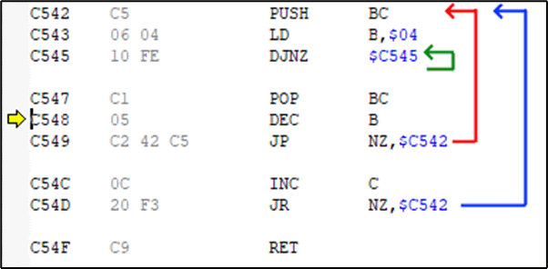
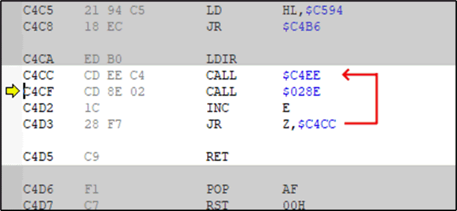
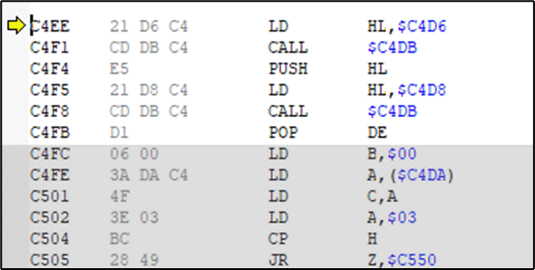
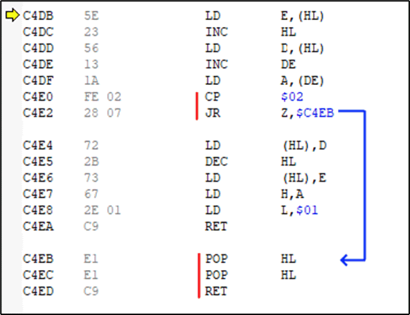
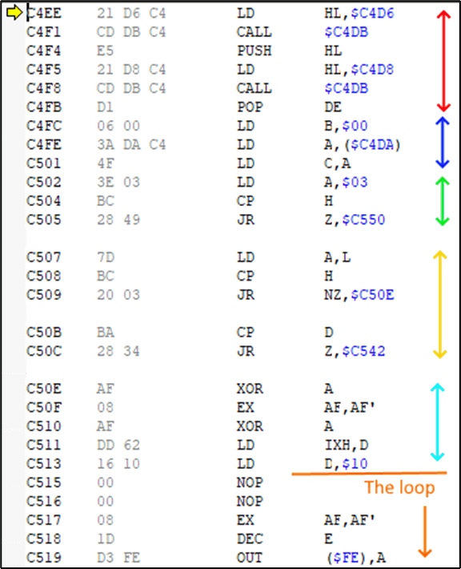

# Decompiling the music from Gyroscope on the ZX Spectrum
Author: Chris Walsh (BloodBaz)  
Date:	9th March 2021

## About the music in Gyroscope 
The theme music for Gyroscope is a two-channel tune using the ZX Spectrum 1-bit “beeper”.  The only way to produce multi-channel sound was with custom routines written in Machine Code / Assembly.  This is because, with no dedicated music chip, the CPU has to spend nearly all its attention on careful timing and control of the beeper in order to play sound.

Gyroscope has three title tunes and one completed game tune.  The three title tunes cycle with each visit to the title page.  The completed game tune is obviously reserved for when you … complete the game!

This document describes the story of how I was able to extract the required information from the game itself and take it to a point where I’ve created a music score and associated MIDI file of the Gyroscope tunes.

There are a number of technical areas required in order to achieve this:

 - Understanding how the code works that actually plays two notes at the same time.
 - Understanding how the code picks up the next note(s) to play so that a tune can be played.
 - Understanding the tune data itself.
 - Understanding the timing of the ZX Spectrum CPU clock
 - How to convert these timings to sound frequencies (pitch) and then onto “notes” on a piano
 - Taking these notes and writing them up in a music package (Muse Score 3) to play/export the final result.

These technical areas will overlap but the above is a rough order in which we have to look at them.

## A Spectrum Emulator
In the old days, most people only had the Spectrum itself in which to debug code, which was very limiting - even with hardware add-ons such as the *Romantic Robot Multiface* that allowed you to stop any program and step though code.  Nowadays, we are blessed with Spectrum Emulators with inbuilt debuggers that make the job far easier.

My emulator of choice is [Spectaculator](https://www.spectaculator.com/).  If you want to follow the process then the following shortcuts will be useful to know:

 - CTRL+ENTER freezes the Spectrum and opens up the debugger.
 - F10 (single step) runs a single assembly code instruction but runs any subroutines (CALL).
 - F11 (step into) runs a single assembly code  but steps INTO any subroutines (CALL)
 - SHIFT+F11 (step out) runs to the end of the current routine
 - ALT+F, 1 is useful to reload the current program/snapshot

This article assumes you have some knowledge of assembly language and debugging but if you don’t you might be able to get the gist of what is happening.

## Locating the Music Routine
This isn’t too hard.  Load up gyroscope from a tzx, tap, sna or similar file and while the title tune is running simply enter the debugger (CTRL+ENTER) and you will most likely be in the middle of the code that plays the music.

What are we wanting to get out of looking at the code?

1. To understand how it plays the two-channel sound
2. To find out where the tune data is being read from
3. To get timing information required later for converting note data to frequencies.

## Understanding the Music Routine Code
When I entered the debugger, I ended up with the PC counter at address C548.  This isn’t ROM so good so far.  Holding down F10 for a bit, I can see that the code is in the middle of running a tightly nested loop with no internal activity:

What I’ve actually stumbled upon is a “pause” routine which carefully plays a rest within the tune.  The length of the pause is determined the value of the C register (the low the value, the longer the rest).  If you are familiar with Z80 assembly code you should recognise that the value in the C register is incremented once per run of the outermost loop (blue) and the routine will exit when C is incremented past FFh (255) and goes back to 00h (0) causing the Z flag to be set and the routine to exist. 

We can make note (no pun intended) of the address of this pause routine (C542h) for later.  Meanwhile, pressing “step out” SHIFT+F11 will run the code until it exits which lands me at C4CFh.

## The Main Loop (C4CFh)
Scrolling up a few instructions we can see that we are now in the middle of another loop:

This loop comprises of calls to two subroutines, an increment of the E register (which sets flags), and a test of the Z flag for which loops around if the Z flag is set or exits the loop if the Z flag is not set.  The only way the Z flag will be set is if the E register holds FFh (255) prior to the INC E as that instruction will increase it to 00h (0) and set the Z flag.

*Note: If you are trying this yourself and you are not at this point in your own debugger, try press CTRL+F11 to step out of whatever routine you are in until you reach one of the above instructions.*

We can use F10 to step through this loop without going into the actual routines. Doing so, we observe the following:

•	The CALL C4EEh instruction plays a single note (well, two notes simultaneously) or a pause (rest) note.
•	The CALL 028Eh is a call into ROM
•	The value of the E register after the call into ROM is always FFh (causing the routine to keep looping to the next note)

As this loop is actually playing each note, I’ve called this the “main loop” routine.

To summarise the ROM routine, this is checking to see if the user has pressed a key on the keyboard.  The music player has to check this after every note to allow the user to start the game or select a game option.  The ROM routine returns the key pressed or FFh (255) if no key is pressed – hence the increment and JR Z to loop.

This just leaves CALL C4EEh which is the main part of the routine as it “plays a single note”.  We can look into this by pressing F10 until we reach C4CCh and then press F11 to “step into” the subroutine.

## The Single Note routine (C4EEh)
*NOTE: For clarify, what I am calling a “single note” is actually going to be a single “semi-quaver” of time – whether that means playing two notes simultaneously, a single note or a rest.*

Most music routines ever written on the ZX Spectrum generally have to do two things when playing a note: 

1. it has to get the next note to play, then 
2. play the note.  

They may have to do some additional things such as:

3. check for the end of the tune (it might loop the to the start or exit the music player)
4. check for keypresses (if interrupting the music is an option)
5. perform any visual screen updates/animations

We already know what to expect from 3-5 as experience of playing Gyroscope shows that the music stops if a key is pressed or if the tune ends; and there are discernible graphical updates going on from what we can see. 

We’ve already encountered the “exit on key press” in the main loop but not the “end of tune” checker so it is only item 3 that we should expect to see alongside 1 and 2.

With that aside, let’s see some of the code in this routine:

The first six instructions make two calls to the same routine at C4DBh.  In each case, HL is set to a value before calling and HL appears to hold something useful as it’s PUSHed onto the stack after the first call and POPed back into DE afterwards. 

Let’s have a look at the routine at C4DBh.

## The “Get Next Note” routine (C4DBh)

If we ignore the instructions in red for a minute, the code in this routine is basically doing the following:

1. It reads the 16-bit value at the address pointed to by HL into DE
2. It adds 1 to DE
3. It reads the byte at the address pointed to by DE into A
4. It writes the new (incremented) value of DE back into the original location pointed to by HL.
5. A bit of register juggling occurs (the value in A is moved to H and L is set to 1)
6. Exits the subroutine

This is the routine responsible for reading a single “note” byte from a stream of data where the “current position” within that stream is stored at a memory address that HL points to.  HL comes to the routine with hard coded values of C4D6h and C4D8h which will be the location in memory where the tune data’s current position is held.

As for the code highlighted in red, if the byte read from the stream = 02h (2) then two values are discarded from the stack and the routine is exited. This tells us that the “end of tune” is denoted by the number 2 in the byte stream and the two POPs gets the music routine to exit the music routine without any complicated checks in the parent routines.

## Back to the Single Note routine
So, returning to the Single Note routine, we appear to have our two “note” values in D and H and the hard coded value of 1 in E and L.

I’m going to jump ahead here and explain the next section of code with the hindsight of having explored it and learned what it does.  However, the two calls of the “Get Next Note” routine that we’ve already seen forms part of a number of initialisation steps that occur prior to playing the actual note.  These handle the type of note to play (two sounds, one sound, a rest) as well as getting the fixed duration of the note to play.

**Red block**: We’ve already learned what this does above.  The 16-bit values at C4D6h and C4D8h are the current position of the first and second note to play (respectively). The routine at C4DBh retrieved these values and moved the positions on one byte. The values are now in D and H, and E and L both hold 01h (1).

**Blue Block**: B is set to 0 and C is read from memory location C4DAh. If you change the value in C4Dah and let the music player run then you will see that you’ve changed the speed (tempo) of the tune.  The higher the value, the faster the tune.  On the tune I’m currently playing this value happens to be EDh which equates to 19 loops when playing the note later.  C is the outer loop (counting upwards) and B is the inner loop (256x) which is set to 0 for consistency.

The next two blocks check for special cases of note values.
Green Block:  If H (Channel 2 note) = 3, then run a special routine at C550h (see later)

**Yellow Block**: (Reminder: We know L contains the value 01h (1) from earlier this is used to compare against the H and D registers).  If both H (Channel 2) = 1 and D (Channel 1) = 1, then run a special routine at C50Eh (see later).

**Cyan Block**: Both A and A’ are set to 0, the Channel 1 note that is stored in D is transferred to IXH so that it can free up D to hold the constant 10h (16) which is used in the loop to flip the 1-bit beeper using a XOR instruction.  Bit 4 of port FEh (254) is the speaker and by having D hold this value, provides a fast way to toggle that bit on and off.

The code then falls straight into the loop code that plays two notes simultaneously.

I should mention at this point that if either or both of the channels hold the value 1, it will in effect play silence or a single note, this is down to the loop always flipping the value in A on every loop.

This completes the intialisation section of the “Play Note” subroutine.  Al registeres are ready to play two notes at the same time.  

### Sidenote: What a “note value” means
We’ve got two 8-bit values (now held in IXh [previously D] and H) which represent the two notes to play.  What going to follow is that these two registers won’t be changing while playing the note but they will be read into two other registers (L and E respectively) and counted down to zero with each iteration of a loop.  Upon reaching zero, a “beeper” bit state will be flipped and the respective countdown register will be topped up again to their original value in IXh or H. These two countdowns will happen independently of each other and control the state of a bit held in two separate registers: A and A’.  They are toggled using an XOR D instruction whenever their counts reach zero and these values are constantly written to the speaker.  As the note value is a countdown, the lower the note value the higher the pitch of the note that it will play.

###  Sidenote: About the loop that plays the sound.
The loop that we are about to encounter runs at a steady 96 T-States for each iteration.  It is important that the timing of the loop is constant irrespective of what needs to go on inside that loop (maybe one of the countdown registers reached 0, or both, or neither).  If the timing is out, the sound will be fuzzy.  This careful timing is important even when playing a single note such as the ROM’s BEEP routine but playing two notes adds complications to keeping the timing of the loop constant, not only because there are different branches that might be taken within a single run of the loop but also because we have a very limited set of registers in which to hold the various counters and states.

### Sidenote: About the duration of the note
We saw that B and C are loaded with values to control the length of the note.  B is the inner loop and counts 256 loops.  C holds the outer loop value and counts upwards so the starting value of EDh represents -19 and so increments 19 times before reaching 0 and exiting the sound routine.

It is important to understand that the note duration controlled by B and C are independent to the counters controlling the two notes. The loop runs at 96 T States so when the duration counter C holds EDh (-19) then the this results in the loop running 256 * 19 = 4864 times and with a constant loop duration of 96 T states, the notes play for 4864 * 96 = 466,944 T States (which on the ZX Spectrum running at 3.54MHz, gives us a “note duration” of 0.132 seconds.

## The critical loop
To play two notes of different pitch simultaneously using a 1-bit beeper involves care toggling of that 1 bit across the two frequencies that you need to play.  The routine shown below shows a loop that starts at C515h though to C54Fh.  As with most “tracker” style music produced for the Spectrum, music is broken up into small equal sized duration “notes” and stepping through the routine shows that a single loop (i.e., each visit back to C515h takes 96 T-States.  This 96 T-States is a very short duration of time which effectively represents the “sample rate” of the sounds being generated.  You can see then by setting a breakpoint at C515h and press F5 to run the music routine for 1 loop and record the T states as shown in the bottom of the window in the diagram.  The number of loops that make up a single two-channel “note” (actually a two note “chord” but I’ll stick to calling it “note” for simplicity) controls both the tempo of the music and this is held in the BC register with B providing 256 loops (looping 00, FF, FE, FD, …, 01, 00) and then C incrementing until it overflows from FF to 00.

On entry to the routine,  C is EF and B is 0.  It takes 19 loops for C to go from EFh to 100h (00h after overflow) and multiplying this by 256 gives us 4864 loops.  With each loop taking 96 T States, a note is played for 466,944 T-States or  and the ZX Spectrum running at 3.54MHz, gives us a “single note” time of 0.132 seconds. This forms the shortest note that can be played and longer notes are just made up of multiple counts of this.

The routine plays the note as follows:

1. The A and A’ registers hold the current high/low state of the two notes.  10h (16) for a high state and 00h (0) for a low state.  A black border is implied by these values.
2. The D register holds the value 10h (16) and is used to toggle the A register when a note needs to switch between high and low.  See the XOR D instructions.
3. The high byte of the IX register (shown is IXH in the image) holds the number of loops (of 96 T-States) that need to occur before “flipping” the A register.  The value is copied into the E register which is decremented on each loop (at C518h).  Upon reaching zero (C51Bh), IXH is copied back into E again and the value in A is flipped (using XOR D at C51F).
4. The second channel has its own frequency counter with H instead of IXH and L instead of E.
5. The Z80 cannot operate directly of the A’ register but between servicing channel 1 and channel 2, the EX AF, AF’ instruction swaps the values in the two registers so both parts work with A.
Once the C register has been exhausted (at C54D) the routine exits, having played a single 2-channel “note”.  We can set a breakpoint at C541 (RET) and run the code listening to a single note by pressing F5.  Each press of F5 plays the next note then stops at the breakpoint.

## Locating the music data
It is now easy to locate the music data for the two channels.  We can breakpoint the music routine at the point at address C4EE before the music plays and “see” what values are held in C4D6 and C4D8.  The 1st byte of the routine is actually 1 higher as the routine at C4DB increments (HL) before reading the value off.  The data blocks also end with the byte 02. Extracting the tunes, we can get confirmation that the same number of bytes are in both the channel 1 and 2 blocks.

Here are the extracted block data:

|   | Tune 1 Channel 1 |Tune 1  Channel 2 | Tune 2 Channel 1 | Tune 2 Channel 2 | Tune 3 Channel 1 | Tune  3Channel 2 |
| ----- | ----- | ----- | ----- | ----- | ----- | ----- |
| Start Addr | C5A8h (50600) | C6C9h (50889) | C7EAh (51178) | C97Bh (51579) | C5A8h (50600) | C6C9h (50889) |
| End Addr   | C6C8h (50888) | C7E9h (51177) | C97Ah (51578) | CB0Bh (51979) | C6C8h (50888) | C7E9h (51177) |
| Length     | 0120h   (288) | 0120h (288)   | 0190h   (400) | 0190h   (400) | 0120h   (288) | 0120h   (288) |

## Extracting the note data
I’m interested in Tune 2 so I took a memory snapshot of the game while in memory and used a hex editor (HxD) to retrieve the 800 bytes of data from Tune 1 and dropped them in an Excel Spreadsheet.

## Converting note data to “notes”
This is something I’ve not done before but it all went pretty smoothly.
